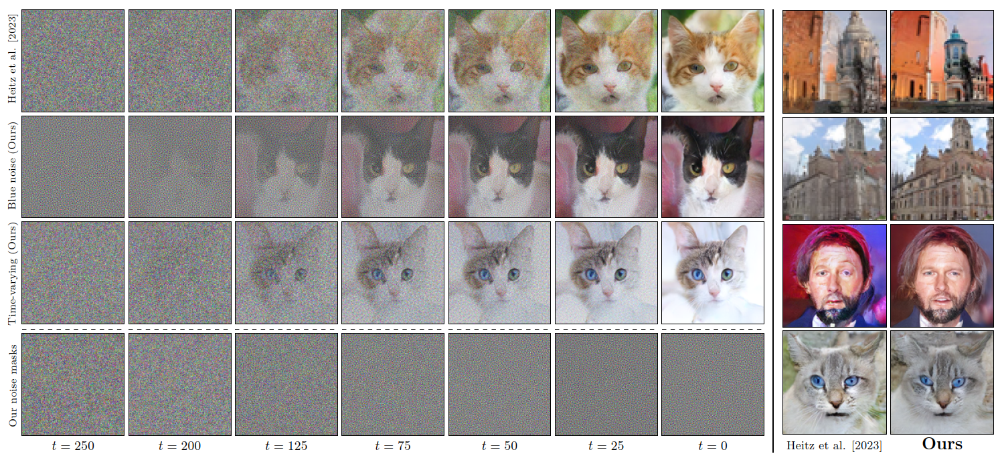

# Blue noise for diffusion models

This repository contains the code for our paper:

> **Blue noise for diffusion models** | [[project page]](https://xchhuang.github.io/bndm)
>
> Xingchang Huang, Corentin Salaün, Cristina Vasconcelos, Christian Theobalt, Cengiz Öztireli, Gurprit Singh
> 
> SIGGRAPH (Conference Proceedings), 2024




**TL;DR** we present:
* a first framework studying the impact of noise correlation within and across images in diffusion models; 
* a novel time-varying noise model (from Gaussian white to blue noise) for denoising diffusion models; 
* a fast blue noise generation method using matmul and tiling; 
* evaluations on image generation, super-resolution and latent diffusion.


## 📰 News

* 06/2024: Code released.


## ✊ Todo
- [ ] training code for latent diffusion


## 📂 Code structure

* `asset`: includes images for the README.
* `bluenoise`: includes `get_noise` function and the lower-triangular matrix for generating Gaussian blue/red noise. Download the two matrices (.npz files) from [here](https://nextcloud.mpi-klsb.mpg.de/index.php/s/PnqYWym2YEnfrD3) and put them into the `bluenoise` folder.
* `scripts`: includes scripts for reproducing the results in the paper.
* `data`: includes datasets for training from scratch and super-resolution test. Download the folder from [here](https://nextcloud.mpi-klsb.mpg.de/index.php/s/PnqYWym2YEnfrD3). `cat_res64` and `cat_res512` are for training. `church_res128_test` is for testing super-resolution. Other folders are dummy with few images inside, you can prepare data in the same format if you need to train on your own data.
* `results_gaussianBN`, `results_gaussianBN_superres`: includes folders of pre-trained models and intial noise for reproducing the figures in the paper. Download the folders from [here](https://nextcloud.mpi-klsb.mpg.de/index.php/s/PnqYWym2YEnfrD3). You can also only download the folders you need and find the corresponding scripts in `scripts/sampling` following the `Usage` section below.


## 🛠️ Installation

Install the required packages in Anaconda by running the following commands:
```
conda create -n bndm python=3.10
conda install pytorch==2.0.0 torchvision==0.15.0 torchaudio==2.0.0 pytorch-cuda=11.8 -c pytorch -c nvidia
pip install diffusers
pip install accelerate
pip install matplotlib
pip install scipy
pip install opencv-python
```

<!-- * Please double check if you have downloaded the required data following the previous section. -->

<!-- * Download the lower-triangular matrix for generating Gaussian blue noise following `bluenoise/README.md`.

* Download pre-trained models following `results/README.md` to reproduce the noise generation and sampling results in the paper.

* Download data following `data/README.md` to train the models from scratch on AFHQ-Cat (64^2, 512^2). -->


## 🗝️ Usage

The following are tested on an NVIDIA GeForce RTX 4090.


### 🤗 Noise generation

Reproduce main paper figure 3, 4, inset, 10 and supplemental figure 1, 2. A folder named `scripts/results` will be automatically created and the results are shown there.
```bash
python scripts/fig_main_3_4_inset_10_supp_1_2.py
```


### 🤗 Sampling using pre-trained models

To reproduce main paper figure 1, 6, 11, 12, we provide the corresponding scripts in `scripts/sampling`:
* `iadb_church_superres_test.sh`: figure 6, corresponds to folders in `results_gaussianBN_superres`
* `church_res64_test.sh`: figure 1, 11, corresponds to folders `results_gaussianBN/church_res64_*`
* `cat_res64_test.sh`: figure 11, corresponds to folders `results_gaussianBN/cat_res64_*`
* `celeba_res64_test.sh`: figure 11, corresponds to folders `results_gaussianBN/celeba_res64_*`
* `cat_res128_test.sh`: figure 12, corresponds to folders `results_gaussianBN/cat_res128_*`
* `celeba_res128_test.sh`: figure 12, corresponds to folders `results_gaussianBN/celeba_res128_*`

Results are shown in a `seqs` within each folder.


### 🚀 Training
To reproduce the training process, we provide the corresponding scripts in `scripts/training`. 
Be careful the newly trained model are saved in the same subfolder inside `results_gaussianBN` and overwrite the one old. Please rename the corresponding subfolder before training a new model.

* `iadb_bn_cat_res64.sh`: training on AFHQ-Cat (64x64)
* `iadb_bn_cat_res512.sh`: (work in progress)

After training, you can use the same sampling script for generating images.


## 👍 Citation
If you find this code useful please consider citing:
```
@article{huang2024blue,
  title={Blue noise for diffusion models},
  author={Huang, Xingchang and Sala{\"u}n, Corentin and Vasconcelos, Cristina and Theobalt, Christian and {\"O}ztireli, Cengiz and Singh, Gurprit},
  journal={arXiv preprint arXiv:2402.04930},
  year={2024}
}
```


## Acknowledgement
* Our code builds upon [iadb](https://github.com/tchambon/IADB/tree/main), [iadb-fun](https://github.com/pharmapsychotic/iadb-fun), [ddim](https://github.com/ermongroup/ddim). We thank the authors for releasing their code.

